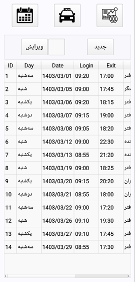

# DayTime

This project is an example of an attendance tracking program that records entry and exit times, dates, commuting expenses, and the number of uses of an item such as a door lock. In the end, it can generate a report.

---

1. Save entry and exit times, address, etc.
2. Save commuting expenses
3. Excel output of information

---
 

